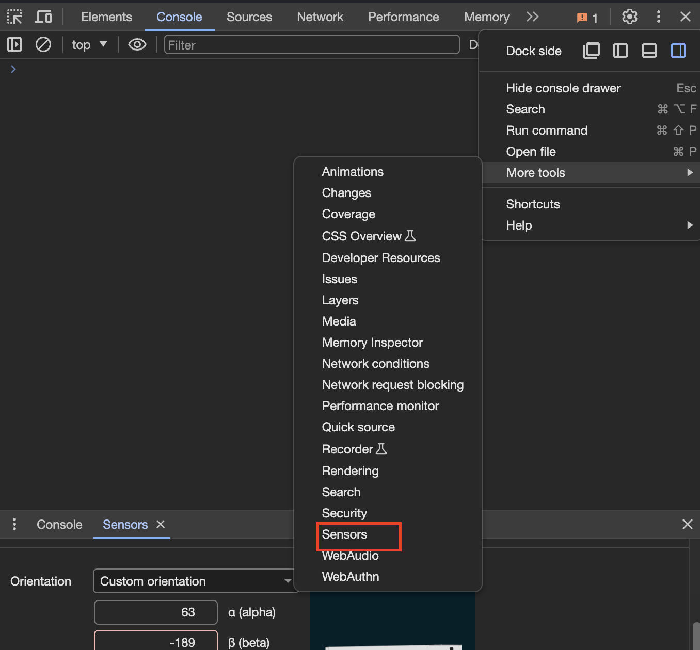
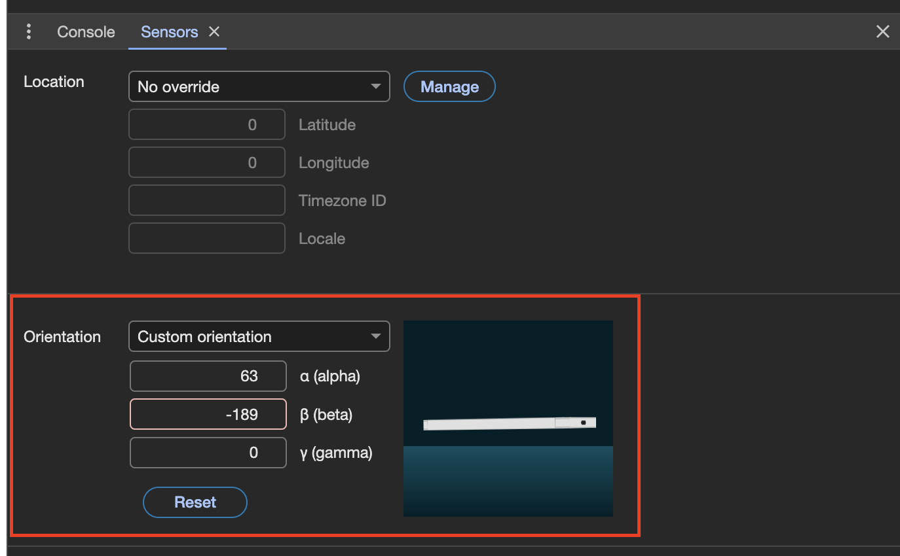

# Kickstart Web Development
- [Kickstart Web Development](#kickstart-web-development)
  - [Wiki for module](#wiki-for-module)
  - [Project](#project)
  - [Javascript input](#javascript-input)
  - [Journal](#journal)
    - [20.02.2024](#20022024)
      - [Brockmann poster](#brockmann-poster)
      - [CSS Animation resources](#css-animation-resources)
      - [Fabulouscss excercise](#fabulouscss-excercise)
      - [Resources and inspiration](#resources-and-inspiration)
    - [27.02.2024](#27022024)
      - [Mike Joyce poster](#mike-joyce-poster)
      - [Matter.js](#matterjs)
      - [Accessing device sensors](#accessing-device-sensors)
        - [Documentation resources](#documentation-resources)
      - [Trying out blending circles](#trying-out-blending-circles)
      - [Resources](#resources)
      - [Trying out pendulum with touch/mouse and orientation](#trying-out-pendulum-with-touchmouse-and-orientation)
      - [Trying out rotating circles, moving left and right](#trying-out-rotating-circles-moving-left-and-right)
    - [05.03.2024](#05032024)
      - [conic gradient](#conic-gradient)
      - [Combining all the color effects on a single page](#combining-all-the-color-effects-on-a-single-page)
    - [12.03.2024](#12032024)
      - [Applying the color effects to a story](#applying-the-color-effects-to-a-story)
        - [Skateboard color blending to show motion](#skateboard-color-blending-to-show-motion)
        - [Telling the story](#telling-the-story)
      - [Using CSS scroll to control animation](#using-css-scroll-to-control-animation)
        - [Animation timeline](#animation-timeline)
      - [Checking if CSS features are supported](#checking-if-css-features-are-supported)
      - [requestAnimationFrame](#requestanimationframe)
      - [Linear interpolation](#linear-interpolation)
      - [Creating CSS gradients](#creating-css-gradients)
      - [getBoundingClientRect](#getboundingclientrect)
      - [Using @property](#using-property)
  - [19.03.2024](#19032024)
    - [Creating a menu as a custom element](#creating-a-menu-as-a-custom-element)
      - [Creating the custom element class](#creating-the-custom-element-class)
      - [Registering the custom element](#registering-the-custom-element)
      - [Integrating it onto a page](#integrating-it-onto-a-page)
      - [Using a shadow root](#using-a-shadow-root)
      - [Specifying a stylesheet in javascript](#specifying-a-stylesheet-in-javascript)
      - [Constructing the element once the element has been created](#constructing-the-element-once-the-element-has-been-created)
      - [Finished menu component](#finished-menu-component)
    - [Using prefers-reduced-motion](#using-prefers-reduced-motion)
    - [Intersection observer](#intersection-observer)
    - [Blend modes](#blend-modes)
  - [26.03.2024](#26032024)
    - [Creating firework effect](#creating-firework-effect)
    - [IIFE](#iife)


## Wiki for module
> See: [github.com - KickWeb2024](https://github.com/digitalideation/KickWeb2024/wiki)

## Project
> See: [Project](project)

- [Brockmann poster](brockmann/musica-viva-1/)
- [Mike Joyce poster](mike-joyce/)
- [Color dance](color-dance/)
- [Skate](skate-scrolly/)

## Javascript input
I have created a resource for my javascript input. You can find it below.
> See: [Javascript input](javascript-input/)

## Journal

### 20.02.2024
We took a look at the basics on HTML and CSS. I focused on working for myself. To see what I achieved, view my documentation below.

#### Brockmann poster
Todays topic were mostly repetition, which is why I focused on recreating a first poster and animate it with css. I chose a poster of Josef Müller-Brockmann of his series "Musica viva". This was an easy example and allows for playful experimentation.

Regarding the font choice, I used Roboto, as it is similar to Akzidenz-Grotesk, which Brockmann uses. See: [github.com - Josef Müller-Brockmann Essay](https://williamipark.github.io/IXD102-Josef-Muller-Brockmann-Essay/index.html)

> See: [Brockmann poster](brockmann/musica-viva-1/)

The implementation was easy, but also a bit challenging, as I am not an expert with CSS animations. I had some issues with the positioning of the elements before and after the animation. The state of the element can be controlled with the css `animation-fill-mode`. By setting this to `forwards` or `backwards`, we can choose what state the element should have after the animation is finished. As I wanted to have an animation that only plays once, to make the elements appear, this was necessary.

#### CSS Animation resources
While implementing the poster, I came across a valuable resource for css animations: [codepen.io - CSS Animation](https://codepen.io/nelledejones/pen/gOOPWrK)

Another helpful resource for CSS animations is also [w3schools - CSS Animations](https://www.w3schools.com/css/css3_animations.asp)

#### Fabulouscss excercise
> I have also created a version of the fabulouscss excercise, which can be found here: [fabulouscss](tag1/fabulouscss/)


#### Resources and inspiration
An important an helpful resource here was, how to import Google Fonts purely with CSS, as we were not allowed to change the html. See: [w3docs.com - how to import Google fonts in CSS file](https://www.w3docs.com/snippets/css/how-to-import-google-fonts-in-css-file.html)

We were given a handful of useful visual inspiration, which is listed below:
- [newrafael.com](https://www.newrafael.com/)
  - creative and abstract websites
- [hallointer.net](https://hallointer.net/)
  - Showcase of various creative websites
- [knoth-renner.com](https://knoth-renner.com/)
  - Showcase of various creative websites

### 27.02.2024
We had repetition on CSS-Selector and an input on flexbox. I am not an expert in flexbox, but have used it quite a lot already and look up the necessary parts, when I have to. I have worked on other topics today, which are documented below.

#### Mike Joyce poster
For today, our preparation is to choose our poster, which we can to create. I will choose a work of Mike Joyce due to the fact, that it reminded me of an idea, that i wanted to realize anyway. He did this work for his SwissTed project which can be found here: [swissted.com](https://www.swissted.com/)


The work this reminded me of, is the work of Felipe Pantone. See: [instagram.com - Felipe Pantone](https://www.instagram.com/felipepantone/). He has a lot of physical artwork, that creates visually appealing color combinations with movable (i assume) plexyglass disks. I wan to combine this with the poster and create digital versions of the physical artworks.

> My first attempt to create the poster is here: [Mike Joyce - The Police](mike-joyce/index.html)

My first implementation aimed to look quite like the original poster. To make it somewhat responsive, I chose to have some breakpoints and adjust the root element width.

I used a grid for the layout of the grid with the circles. I created it on [grid.layoutit.com](https://grid.layoutit.com/). The circles itself are positioned at the center of the containing cell. I apply a `transform` to shift the circles up, down, left and right.

As the circles on the poster play with the mix of the colors, I applied the `mix-blend-mode: multiply;` to achieve a similar effect like on the poster.

As for animation, I went on to just make the circles alternate in position either up or down. This creates a nice effect of the colors mixing together.

For interactivity, I added a hover effect, which disables the animation. This leads to the effect, that the animaton goes out of sync and after hovering over multiply elements, the grid is quite mixed up.

I might continue to a better implementation of this poster in a different form, but for now, I will try to do a work of Felipe Pantone.

#### Matter.js
As I want to have a poster/experience, that can mix colors, similar to this video [Felipe Pantone - Pendulum color mix](https://www.instagram.com/p/CoUqdGtADxr/), I have started to look at a javascript library called [github.com - matter.js](https://github.com/liabru/matter-js).


Matter.js is quite easy to use, as I figured out with a tutorial from Daniel Shiffmann. See: [youtube.com - 5.17: Introduction to Matter.js - The Nature of Code](https://www.youtube.com/watch?v=urR596FsU68)

For now, I kept it simple and downloaded a version of p5.js and matter.js to a folder and included it in the html directly. For the final projects, I aim to use Vite for packaging javascript.

Matter.js provides it's own renderer, but in the tutorial, p5.js is used to have more control on how the content is rendered.

Below is the basic code, created in the tutorial which has some basic functionality, where you can click on the screen and place boxes. The boxes fall down with gravity onto a floor.

```javascript
// module aliases
var Engine = Matter.Engine,
    // Render = Matter.Render,
    Runner = Matter.Runner,
    Bodies = Matter.Bodies,
    Composite = Matter.Composite;

var engine;
var world;
var boxes = [];
var ground;

function setup() {
    createCanvas(400, 400);
    engine = Engine.create();
    world = engine.world;
    Runner.run(engine);
    ground = Bodies.rectangle(200, height, width, 20, { isStatic: true });
    Composite.add(world, ground);
}

function mousePressed() {
    let newBox = new CustomBox(mouseX, mouseY, random(20, 40), random(20, 40));
    boxes.push(newBox);
}

function draw() {
    background(220);
    for (let customBox of boxes) {
        customBox.show();
    }
}
```

The code for the CustomBox below, initializes a class which has a matter.js body and adds it to the world. The box is then drawn using p5.js.
```javascript
class CustomBox {
    constructor(x, y, width, height) {
        this.body = Bodies.rectangle(x, y, width, height, { friction: 0.5, restitution: 1, airFriction: 0 });
        this.width = width;
        this.height = height;
        Composite.add(world, this.body);
    }
    show = function () {
        var pos = this.body.position;
        var angle = this.body.angle;
        push();
        translate(pos.x, pos.y);
        rotate(angle);
        rectMode(CENTER);
        rect(0, 0, this.width, this.height);
        pop();

    }
}
```

> The working example can be tried out here: [Falling boxes](codingtrain-matterjs-introduction/)

#### Accessing device sensors
To try out, how I can access the sensor data of a device, I have started a testpage.

> See: [Sensor testpage](sensors-testpage/)

This page displays the acceleration and the orientation. Acceleration is not available on desktop for most devices. Orientation can be simulated in the browser.

> To simulate the orientation, go into dev tools and then click on `More tools` and then `Sensors`
> 
>
> Once opened, the value for alpha, beta and gamma can be adjusted with a little preview.
> 

To detect the device orientation, the deviceorientation event can be used:
```javascript
window.addEventListener("deviceorientation", handleOrientation, true);
```

##### Documentation resources
- Documentation for device motion: [developer.mozilla.org - devicemotion event](https://developer.mozilla.org/en-US/docs/Web/API/Window/devicemotion_event)
- Documentation for device orientation: [developer.mozilla.org - deviceorientation events](https://developer.mozilla.org/en-US/docs/Web/API/Window/deviceorientation_event)
- Detection of mobile browsers for various languages and frameworks: [detectmobilebrowsers.org](http://detectmobilebrowsers.com/)

#### Trying out blending circles
As an excercise to try out rotation circles and blending colors, I created another test page.

> See: [Dancing circles](color-dance/)

While creating this page, I learned a lot about creating smooth animations and also creating transitions between elements.

- [mozilla.org - Animation composition](https://developer.mozilla.org/en-US/docs/Web/CSS/animation-composition) can be used to control how animations behave when they control the same css property.
  - `replace` overrides the underlying value of the property.
  - `add` builds on the underlying value of the property.
  - `accumulate` combines the values.
- [css-tricks.com - Controlling CSS animations and transitions with Javascript](https://css-tricks.com/controlling-css-animations-transitions-javascript/)
- [weschools.com - CSS transitions](https://www.w3schools.com/css/css3_transitions.asp) to control how to transition between values if a property changes
- [mozilla.org - aspect ratio media query](https://developer.mozilla.org/en-US/docs/Web/CSS/@media/aspect-ratio) to define CSS for specific aspect ratios
- [mozilla.org - radial gradient](https://developer.mozilla.org/en-US/docs/Web/CSS/gradient/radial-gradient) to create radial gradient backgrounds
- [w3schools.com - CSS animation](https://www.w3schools.com/css/css3_animations.asp) for general knowledge on animations

#### Resources
- [cubic-bezier.com - Visualize and create bezier values for CSS](https://cubic-bezier.com/#.21,.6,.45,.81)
- [color-name.com - Get the name of a hex color](https://www.color-name.com/hex/ffe103)

#### Trying out pendulum with touch/mouse and orientation
I wanted to achieve a color combination page, which uses 3 pendulums. To do so, I have created a page, where you can control the rotation of the pendulum with the orientation of the device(smartphone) or with the mouse/touch position x.

> See: [Pendulum swing with motion](pendulum-swing-with-motion/)

#### Trying out rotating circles, moving left and right
I created this page to achieve a color combination effect with circles that alternate from left to right, and the circles also rotate around the center of the box they are in.

> See: [Alternating circles](alternating-circles/)

### 05.03.2024

#### conic gradient
As I achieved my previous pages, I have created another page, which was inspired by the artist Felipe Pantone.


To do this page, I have created various circles which use a conic gradient. A conic gradient is defined like this:

```css
background-image: conic-gradient(from 0deg at 50% 50%, cyan 0%, magenta 33%, yellow 66%, cyan 100%);
```

Once these circles were correctly placed, I made it interactive, by creating a radial slider so I can rotate them according to the slider. To get the effect, that each circle rotate in its own speed, I used linear interpolation.

TODO: https://codepen.io/MyXoToD/pen/xGRrgQ

> See: [Gradient wheel](gradient-wheel/)

#### Combining all the color effects on a single page
Once I finished all of these pages, I wanted to combine them on a single page. I did so by using a grid layout.

```css
#grid-container {
    display: grid;
    grid-template-columns: repeat(auto-fit, minmax(20rem, 30rem));
    grid-template-rows: 20rem;
    grid-auto-rows: 20rem;
    gap: .5rem;
    margin: 0 auto;
    justify-content: space-around;
    margin-bottom: 4rem;
}
```

This grid layout places the color effects on a 2 by 2 grid, when the screen is big enough, but reduces it to a 1 by 4 grid, when the screen is smaller.

> See: [Color dance](color-dance)

### 12.03.2024

#### Applying the color effects to a story
After discussing my previous learnings and results with my teacher, we came to the conclusion, that it would be cool to apply it to a story. I was already quite satisfied with my previous results, as they were designed carefully and showed off a cool playground for color blending, motion and interactivity.

To proceed, I thought of creating a page that tells the story of my relationship to my skateboard. It is a quirky skateboard, that is very handy, and also quite an eyecatcher.

##### Skateboard color blending to show motion
First, I created the skateboard with different html elements and styled it. I applied various animations to the different elements of the skateboard. To get the skateboard to look like it is moving, I blended the wheels and also moved the skate deck slightly.

##### Telling the story
To get a story, I thought about the various reasons I like skateboarding and also what benefits I get from it. As a funny ending, I also want to integrate an accident that has happened. I don't want it to be text heavy, so I want to use short and easy sentences. So I came up with the following:
- drive a quirky skate
  - Serves as a title and also describes a main attribute of the skateboard
  - Show off how the skateboard looks
- it's a huuge timesaver
  - I travel a lot around cities. Distances in cities are often times not that long, but require you to wait for a connection or get multiple connections. For these distances I mostly use my skateboard and sometimes can catch a later train and still arrive on time.
- you get the looks
  - I don't really drive the skateboard to show off, however I still enjoy the attention it gets. It is a way to turn heads for many people, even though skateboards are nothing new.
- people connect
  - My skateboard is a conversation starter and I get asked a lot of questions about it. This is an easy and fun way to get to know new people.
- don't get it wet
  - Sometimes people want to try out my skateboard, but can't really handle it. That's also why it has also gone diving once. Luckily it survived, but I don't want it to happen again.

To get an impression of the project:
> See: [Skate](skate-scrolly/)

#### Using CSS scroll to control animation
To create scrollytelling I wanted to use [mozilla.org - animation-timeline](https://developer.mozilla.org/en-US/docs/Web/CSS/animation-timeline) and [mozilla.org - animation-range](https://developer.mozilla.org/en-US/docs/Web/CSS/animation-range). These features are currently experimental and sadly not supported by all browsers, so it is currently necessary to also create a fallback for browser who don't support it.

I have used it for the page, so that the skateboard in the first section rotates and the drives along the page.

To do so I have used the following style:
```css
animation-timeline: scroll();
animation-name: rotate-quirky-skate;
animation-range: entry 0% contain 100%;

@keyframes rotate-quirky-skate {
    0% {
        transform: rotate(0deg) translate(-50%, -50%) scale(1);
        left: 50%;
        top: 50%;
    }

    20% {
        transform: rotate(180deg) translate(-50%, 50%) scale(1);
        left: 60%;
        top: 50%;
    }

    40% {
        transform: rotate(180deg) translate(-50%, 49%) scale(1);
        left: 55%;
        top: 50%;
    }

    60% {
        transform: rotate(180deg) translate(-50%, 48%) scale(1);
        left: 60%;
        top: 50%;
    }

    70% {
        transform: rotate(180deg) translate(-50%, 47%) scale(1);
        left: 55%;
        top: 50%;
    }

    80% {
        transform: rotate(180deg) translate(-50%, 46%) scale(1);
        left: 50%;
        top: 50%;
    }

    90% {
        transform: rotate(180deg) translate(-50%, 45%) scale(1);
        left: 55%;
        top: 50%;
    }

    93% {
        transform: rotate(180deg) translate(50%, 44%) scale(0.7);
        left: 50%;
        top: 50%;
    }

    98% {
        transform: rotate(180deg) translate(50%, 43%) scale(0.5);
        left: 50%;
        top: 80%;
    }

    100% {
        transform: rotate(180deg) translate(50%, 42%) scale(0.5);
        left: 50%;
        top: 120%;
    }
}
```

Another helpful resource for CSS scroll animation is [scroll-driven-animations.style](https://scroll-driven-animations.style/)

##### Animation timeline
The property [mozilla.org - animation-timeline](https://developer.mozilla.org/en-US/docs/Web/CSS/animation-timeline) is used to define the timeline which controls the animation. I have used `scroll()` which then refers to how much the user has scrolled in the parent container. In my case this is the document, so it refers to the whole page. Other values are `view()` which refers to the visibility of an element. This can be tested out here [scroll-driven-animations.style](https://scroll-driven-animations.style/tools/view-timeline/ranges/) which uses it in combination [mozilla.org - animation-range](https://developer.mozilla.org/en-US/docs/Web/CSS/animation-range). The `view()` function supports various different values, see [mozilla.org - view](https://developer.mozilla.org/en-US/docs/Web/CSS/animation-timeline/view)

#### Checking if CSS features are supported
As some features are experimental, it is quite handy to check if certain CSS features are available for use. To do so, we can use [mozilla.org - CSS.supports](https://developer.mozilla.org/en-US/docs/Web/API/CSS/supports_static).

#### requestAnimationFrame
[mozilla.org - requestAnimationFrame](https://developer.mozilla.org/en-US/docs/Web/API/window/requestAnimationFrame) can be used to call a callback before painting the next frame.

#### Linear interpolation
[wikipedia.org - Linear interpolation](https://en.wikipedia.org/wiki/Linear_interpolation) can be used to find the value of a point that lies somewhere between two points. 

1. You have two known points on a line.
2. You want to find a point between these two known points.
3. Linear interpolation assumes that the change from the first point to the second point is constant.
4. It calculates the value of the unknown point by taking into account the proportion of distance it lies between the two known points.

A javascript implementation looks like this:
```javascript
function linearInterpolation(start, end, amount) {
    // This function calculates linear interpolation between two values.

    // Formula for linear interpolation: 
    // (1 - amount) * start + amount * end

    // Calculate the interpolated value using the formula
    var interpolatedValue = (1 - amount) * start + amount * end;
    
    // Return the interpolated value
    return interpolatedValue;
}

```

#### Creating CSS gradients
A helpful to create CSS gradients is [cssgradient.io](https://cssgradient.io/) or [colorgradient.dev](https://colorgradient.dev/gradient-generator/)

#### getBoundingClientRect
[mozilla.org - getBoundingClientRect](https://developer.mozilla.org/en-US/docs/Web/API/Element/getBoundingClientRect) can be used to get information about the size of an element and its position relative to the viewport.

#### Using @property
To transition or animate gradients fluently, we can use [mozilla.org - @property](https://developer.mozilla.org/en-US/docs/Web/CSS/@property). First we define the property:
```css
@property --gradient-color-1 {
    syntax: "<color>";
    inherits: false;
    initial-value: #FF007B;
}
```

Then we animate the properties:
```css
@keyframes colorChange {
    50% {
        --gradient-color-1: #FFE300;
        --gradient-color-2: #AA396F;
    }
    100%{
        --gradient-color-1: #FF007B;
        --gradient-color-2: #00DDFF;
        --gradient-angle: 360deg;
    }
}
```

Like that, the colors transition seamlessly.

> See: [Gradient color change](gradient-color-change)

## 19.03.2024

### Creating a menu as a custom element
To navigate all the projects that I have created througout this module, I wanted to create a menu that is accessible on each page. In order to have a reusable menu, that I can easily integrate into each page, I have created a custom element or so called web component.

Documentation on web components is available on [webcomponents.org](https://www.webcomponents.org/introduction)

#### Creating the custom element class
The component is implemented as a class that extends the `HTMLElement`:
```javascript
class ProcessMenu extends HTMLElement {
}
```

#### Registering the custom element
In order to register the element and make it available, we have to define it:
```javascript
window.customElements.define('process-menu', ProcessMenu);
```

#### Integrating it onto a page
In order to integrate it on a page, the javascript file has to be included and the element has to be used.
```html
<script type="text/javascript" src="../process-menu/process-menu.js"></script>
```

Include the element inside the HTML body:
```html
<process-menu></process-menu>
```

#### Using a shadow root
To have completely independent styling from the document we are integrating the custom element, we can create a shadow root. A shadow root is rendered separately from the main DOM. See: [mozilla.org - ShadowRoot](https://developer.mozilla.org/en-US/docs/Web/API/ShadowRoot)
I have created a constructor in the custom element class which creates the shadow root by calling [mozilla.org - attachShadow](https://developer.mozilla.org/en-US/docs/Web/API/Element/attachShadow):
```javascript
constructor() {
    super();
    this.shadowRoot = this.attachShadow({ mode: "closed" });
}
```

The option `mode` specifies if the page, on which the component is integrated, can access the shadow root via javascript. Specifying `open` makes it accessible, and specifying `closed` makes it inaccessible.

#### Specifying a stylesheet in javascript
In order to style the custom element, I have created a stylesheet inside of javascript and added it to the shadow root.
```javascript
const styleSheet = new CSSStyleSheet();
styleSheet.replaceSync(`
* {
    font-family: 'Unbounded', sans-serif;
    font-size: 16px;
}`);
this.shadowRoot.adoptedStyleSheets = [styleSheet];
```

#### Constructing the element once the element has been created
In order to create the HTML inside of my element, we can use the `connectedCallback` which is called when the element is added to the DOM:
```javascript
connectedCallback() {
  // Create elements
}
```

#### Finished menu component
> See: [Process menu](process-menu/)

### Using prefers-reduced-motion
An important part of the web is to take accessibility into account. One such feature is the css media feature [mozilla.org - prefers-reduced-motion](https://developer.mozilla.org/en-US/docs/Web/CSS/@media/prefers-reduced-motion). With this media feature, we can remove, reduce or replace non-essential motion.

Such animations can trigger discomfort for those with [a11yproject.com - vestibular motion disorders](https://www.a11yproject.com/posts/understanding-vestibular-disorders/). Animations such as scaling or panning large objects can be vestibular motion triggers.

> **The recommendation on the referenced site is:** Don't make animations, sliders, videos, or rapid movement start automatically. Give an indicator of what movement will happen on the site when someone takes action. Allow the option to turn off any animation and movement at any point in the process.

### Intersection observer


TODO: https://developer.mozilla.org/en-US/docs/Web/API/Intersection_Observer_API

TODO: https://developer.mozilla.org/en-US/docs/Web/SVG/Tutorial/Paths

TODO: https://codepen.io/zFunx/pen/WjVzWo

TODO: https://www.youtube.com/watch?v=szztTszPp-8&list=PLRqwX-V7Uu6akvoNKE4GAxf6ZeBYoJ4uh&ab_channel=TheCodingTrain


TODO: drip drop animation https://codepen.io/abehjat/pen/oXMENv

TODO: how to create a new blend layer for mix-blend-mode by using position: relative and z-index

### Blend modes
TODO: https://web.dev/learn/css/blend-modes


## 26.03.2024
TODO: documentation of perspective, implementing slot wheel

Feedback:
Think about user guidance, what is the perspective of the user
Think about a longer section
Think about loud/silent
Think about driving through the sections
Maybe posters driving by


### Creating firework effect
> Based on [alvaromontoro.com - Creating a firework effect with css](https://alvaromontoro.com/blog/68002/creating-a-firework-effect-with-css)

A simple firework effect can be created using purely css and html.
To do so, we create an element that is absolutely positioned and has different radial gradient set as its background:
```css
.firework {
    position: absolute;
    top: 50%;
    left: 50%;
    transform: translate(-50%, -50%);
    width: 0.5vmin;
    aspect-ratio: 1;
    background:
        /* random backgrounds */
        radial-gradient(circle, #00f 0.2vmin, #0000 0) 50% 00%,
        radial-gradient(circle, #00f 0.3vmin, #0000 0) 00% 50%,
        radial-gradient(circle, #00f 0.5vmin, #0000 0) 50% 99%,
        radial-gradient(circle, #00f 0.2vmin, #0000 0) 99% 50%,
        radial-gradient(circle, #00f 0.3vmin, #0000 0) 80% 90%,
        radial-gradient(circle, #00f 0.5vmin, #0000 0) 95% 90%,
        radial-gradient(circle, #00f 0.5vmin, #0000 0) 10% 60%,
        radial-gradient(circle, #00f 0.2vmin, #0000 0) 31% 80%,
        radial-gradient(circle, #00f 0.3vmin, #0000 0) 80% 10%,
        radial-gradient(circle, #00f 0.2vmin, #0000 0) 90% 23%,
        radial-gradient(circle, #00f 0.3vmin, #0000 0) 45% 20%,
        radial-gradient(circle, #00f 0.5vmin, #0000 0) 13% 24%;
    background-size: 0.5vmin 0.5vmin;
    background-repeat: no-repeat;
    animation: firework 1s infinite;
}
```

The initial width of the container of the firework is set to be tiny(`width: 0.5vmin`) so that the spread parts of the firework are not visible initially.

To create the animation, we can increase the size of the container and then we see the spread of the different gradients.
```css
@keyframes firework {
    0% {
        width: 0.5vmin;
        opacity: 1;
    }

    100% {
        width: 45vmin;
        opacity: 0;
    }
}
```

> See: [Firework](fireworks/)

TODO: https://userinyerface.com/game.html

### IIFE
TODO: Immediately invoked function expressions


TODO: https://codesweetly.com/javascript-function-object

TODO: use vmin instead of media queries for sizing

TODO: css isolation

https://developer.chrome.com/blog/autoplay/

https://developer.mozilla.org/en-US/docs/Web/Media/Autoplay_guide